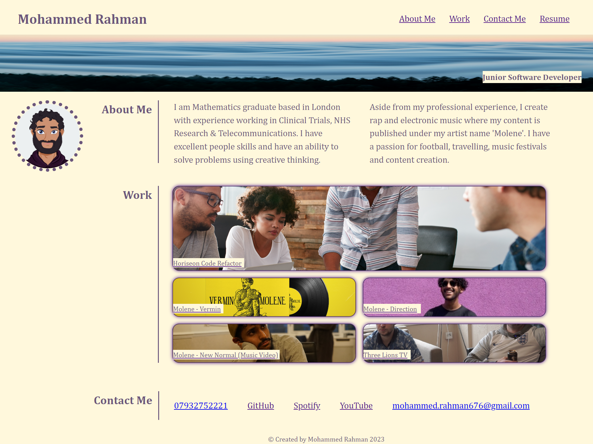

# Using HTML & CSS to structure and design a portfolio of past projects into a web page.

## Created to present a portfolio of past work including web development projects and side work in music and content creation.

This is a landing page for my work portfolio. The aim of created this page was to showcase teachings of HTML structure and CSS styling had been implemented in a form which can be used in future as I will intend to update the work portfolio over time as I work on new projects. I completed this by:

* Ensuring the page presented my name, avatar and links to sections about me, my work, and how to contact me / find my work.
* Ensuring links in the navigation when clicked in the UI then scrolls to the corresponding section
* Ensuring when users view the work portfolio section that the section contains titled images of my applications, that the first project image is larger in size than the others and that users are redirected to the content page when the application is clicked on.
* That the page is resized or viewed on various screens and devices so that the layout is responsive and adapts to the users viewport

## Table of Contents

* [Installation](#installation)
* [Usage](#usage)
* [Credits](#credits)
* [License](#license)

## Installation

* Go onto 'https://github.com/mrahman676/project-portfolio' and clone the repo into your terminal
* Create a folder within your local drive to save the repo in using mkdir 'file-name'
* Use code . to open it in your code editor (mine is VS Code)

## Usage 

* You can find the HTML document (portfolio.html) within the 'Project-Portfolio' document, but the CSS stylesheet (portfolio.css) is found within the 'CSS folder' within the 'Project-Portfolio' folder.
* In the navigation bar within the header there are 3 buttons (About Me, Work, Contact Me) that redirect you to each section of web page. The final button (Resume) opens a PDF of my resume onto a new tab.
* In the main body of the web page you can find a section titled 'About Me' with two paragraphs alongside each other describing myself, my professional experience and passions. 
* Then you can find a section titled 'Work' with several images that can be clicked upon to redirect you to another tab where the project can be found
* Lastly, there is a 'Contact Me' section which has links to my number which opens up on a mobile device to be called, an email which opens up to be emailed to and links to my GitHub, Spotify & Youtube accounts respectively.

Please check out a preview of the page here:

## License

MIT License 2023

For more info please refer to: https://snyk.io/learn/what-is-mit-license/#what-is

## Badges

